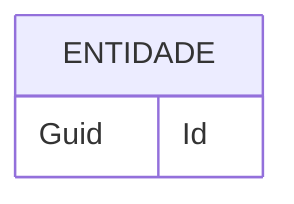

# Template de ER

> Copie este arquivo para `docs/er/ER-NNN-nome.md`.

# ER-001 — Nome da entidade

- **Status:** Proposto | Aprovado | Implementado | Deprecado

## Descrição

O que a entidade representa no domínio.

## Atributos

| Campo | Tipo | Obrigatório | Descrição |
|---|---|---|---|
| Id | Guid | Sim | Identificador único |
| ... | ... | ... | ... |

## Relacionamentos

- `Entidade` 1—N `EntidadeRelacionada` (descrição)

## Vínculos

- **Requisitos funcionais:** RF-001
- **Regras de negócio:** RN-001
