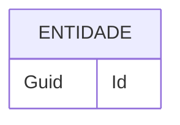

# Template de ER

> Copie este arquivo para `docs/modelagem/ER/ER-NNN-nome.md`.
>
> ⚙️ A tabela do índice [Modelo de Entidades](/docs/modelagem/ER) é **gerada
> automaticamente** a partir dos arquivos desta pasta. Preencha no frontmatter:
> `codigo`, `description` e `status` (ER não usa prioridade).

## Descrição

O que a entidade representa no domínio.

## Atributos

| Campo | Tipo | Obrigatório | Descrição |
|---|---|---|---|
| Id | Guid | Sim | Identificador único |
| ... | ... | ... | ... |

## Relacionamentos

- `Entidade` 1—N `EntidadeRelacionada` (descrição)

## Vínculos

- **Requisitos funcionais:** RF-001
- **Regras de negócio:** RN-001