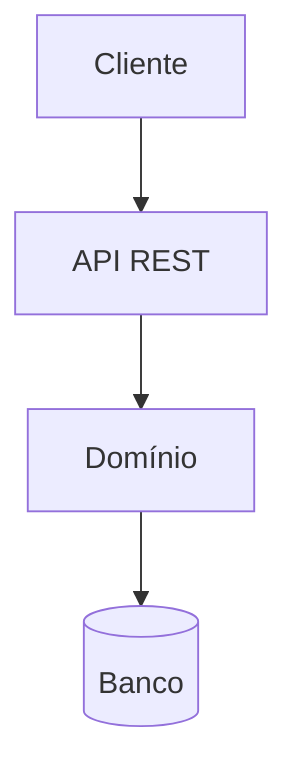
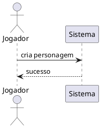

# Diagramas no Docs

O Existentia.Docs suporta **dois** motores de diagrama, para que cada um seja usado
onde é mais adequado:

| Motor | Renderização | Melhor uso | Suporte nativo |
|---|---|---|---|
| **Mermaid** | Cliente-side (JS) | Fluxos, ER simples, UC, mindmap | Sim (`@docusaurus/theme-mermaid`) |
| **PlantUML** | Servidor externo | Arquitetura, componentes, C4, sequência detalhada | Via `docusaurus-theme-plantuml` |

## Mermaid

Basta usar um bloco de código com a linguagem `mermaid`:

````markdown

````

Resultado:


## PlantUML

Documentos `.md`/`.mdx` podem usar blocos `plantuml` (habilitado via
`renderCodeBlockPuml`) ou apontar arquivos `.puml` importados. Exemplo de sequência:

````markdown

````

> **Atenção:** por padrão, o tema PlantUML envia o diagrama ao servidor público
> `plantuml.com` para renderização. Para conteúdo sensível/offline, deve-se
> configurar um servidor próprio (ex.: container `plantuml/plantuml-server`) ou
> renderizar localmente no build — ver ADR/guia de infraestrutura.
